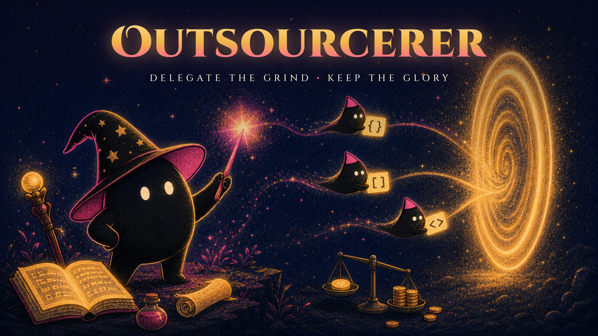

<div align="center">



[](https://github.com/alexgreensh/outsourcerer/releases)
[](https://github.com/alexgreensh/repo-forensics)
[](LICENSE)


### Your frontier model is doing grep.

Outsourcerer hands the grunt work to the cheapest engine you already pay for, brings in a stronger one (or a whole panel of them) when it matters, and shows you the receipt.

</div>

---

You already pay for a fleet of AIs: Claude, Codex, Gemini, maybe Devin, a stack of OpenRouter credits. Each is brilliant at something the others aren't, and they sit in separate rooms. **Outsourcerer makes them work as one team.** It sends the boring work to the cheapest engine that can nail it, pulls a top-tier model in when the job actually needs a big brain, keeps a running receipt of what that saved you, and, uniquely, clones **your** setup onto whichever engine runs the job.

## It doesn't just call another model. It brings your whole workshop.

When Outsourcerer hands a job to a different engine or harness, that engine doesn't show up empty-handed. It carries **your** setup with it: the same skills, the same plugins, the same MCP servers your main agent uses. A cheap model running on Devin can use your custom skill and reach your MCP tools exactly the way your Claude session would. It's the difference between borrowing a stranger's bare laptop and having your own, fully set up, wherever the work happens to run.

---

## The opportunity hiding in your subscriptions

You're already smart about this. Even inside Claude Code you hand the small stuff to Sonnet instead of Opus. Good instinct, Outsourcerer just takes it further than any single harness can:

- What if that same errand could run on an even cheaper engine, sometimes near-free on a subscription you already pay for, at quality that rivals your frontier model?
- What if a couple of stronger models could sanity-check your plan *before* you build, in parallel, without you leaving your session or wiring up a thing?

The models and the subscriptions are already on your machine. You *could* stand up a full multi-agent system to connect them, and sometimes that's exactly the right call. Outsourcerer is the lighter path for when you just want the work moved to the right engine and the savings counted.

---

## You talk. The sorcerer handles it.

No flags to memorize, no routing tables. You say what you want; it checks what you actually have installed, picks the right engine, and offers you the cheap path before spending a cent it didn't have to.



If something isn't installed, it tells you the one command to fix it. You just say yes.

---

## Advisors: bring the big brains in, several at once


Delegation runs both directions. Push work *down* to a cheaper model to save money, or pull the **strongest** models *up* as advisors to make the work better, and not just one:

- **Convene a panel.** Spin up **several strong models in parallel**, one from each subscription if you like (say Sol on Codex, Fable on Claude, Hy3 on OpenRouter), to review a plan or a diff at the same time.
- **Act only on consensus.** Outsourcerer greenlights the work when the panel agrees; a split isn't a coin flip, it's a signal to bring the decision back to you.
- **Improve, don't just grade.** Ask the advisors to rewrite the weak parts and fold in each other's fixes, not merely flag them.



A second, differently-wired head at the right moment is where the real leverage is. Three of them, agreeing, is even better.

---

## One spell, tailored to each model


The models don't think alike, so Outsourcerer doesn't prompt them alike. The right prompting techniques are **baked in per capability tier**: it frames a task for GPT-5.6 one way, for Fable another, for a genuinely small model a third, each to its strengths. And cheap does not mean dumb: **GLM-5.2, Hy3 and DeepSeek are `capable` tier, frontier capability at a budget price (~Opus-4.8 class)**, so they get the same high-autonomy prompting as the flagships, not a hand-holding work order. You ask in plain language; the sorcerer translates it into the dialect each engine actually responds to. You get better output from the cheap lane than you'd get by sending it the prompt you'd send Claude. Dial thinking depth per task with `--effort`.

---

## What you can ask it to do

- **Offload the grind.** Repo mapping, mechanical refactors, running the test suite, big searches. Cheap model does it; your main agent stays the boss.
- **Bring your setup along.** Hand the job your skills, plugins, and MCP servers so the delegate works with your tools, not a bare model, even on another harness.
- **Convene advisors.** Have several stronger models review a plan or a diff in parallel, improve it, and only proceed on consensus.
- **Run agents in parallel.** Fan out a whole multi-agent gauntlet (a QA sweep, a per-module review, N reviewers) across any backend at once with `fanout`, watch them live, and collect every finding into one file. No 16-session bootstrap tax.
- **Generate images.** **GPT-image first** on your Codex plan (keyless, no API credits), then nano-banana or an OpenRouter image model. *(Every illustration in this README was rendered exactly this way, by Outsourcerer, keyless, `$0` cash.)*
- **Review anything visual.** Screenshots, UI, design, handed to Gemini, keyless on your Antigravity login.
- **Run it on your own machine.** A local model on Ollama or LM Studio runs the job on your hardware: `$0`, no tokens burned, fully private. *(Its own section below.)*
- **Find the cheap seats.** Ask what's free or cheap right now across your platforms (`suggest`). It reads each catalog live, so it keeps up as new models drop (a fresh free model on Devin or OpenRouter shows up on its own).
- **See what you're saving.** The **Tab** shows real spend vs your frontier model, per lane.

All of it in plain language. The commands underneath are the sorcerer's, not yours.

---

## Run it on your own machine


Point the sorcerer at a local model on Ollama or LM Studio and the whole job runs on your hardware: **`$0`, no tokens burned, nothing leaves the building.** Three reasons people reach for it, all good ones: you just prefer running your own models, you'd rather not spend the tokens, or the code is too sensitive to hand any cloud model. Outsourcerer's `doctor` spots a running local server on its own and offers the private lane, so `run` streams text with zero setup. And when you want the model to actually read your repo and use tools, the agentic path drives it right inside the harness, still local, still keyless. *(The harness plumbing is certified end to end; how much it can chew depends on your local model's own tool-calling.)*

---

## The Tab: a receipt you can actually believe


Most "cost saver" tools show you a number they made up. This one keeps two honest columns, because they aren't the same kind of cost. **Cash** is real money on OpenRouter/API lanes. **Plan limits** are your Codex / Claude / Antigravity / Devin subscription windows: no cash, but finite, so we show what you actually burned of them, never a fake "free."

```
  == The Tab ==  (real output, 2026-07-10)
  runs recorded          : 12
  cash billed (measured)  : $0.002245   REAL per-generation OpenRouter cost, captured on bg runs
  cash lanes, est-only    : 5 run(s)    foreground; run in bg to capture measured $
  on your subscription    : 3 run(s)    $0 cash, spent your ChatGPT / Claude / Antigravity plan limits
    ChatGPT plan usage, 5h window: 6% (resets in 4h 32m) · weekly: 1%
  note: a $0 cash line is NOT "free", subscription lanes spend finite plan rate limits.
```

That `$0.002245` is not an estimate. For OpenRouter lanes the Tab reads the **exact per-generation cost** back from the provider after the run, because the harness's own built-in cost number runs roughly **28× high** on cheap lanes. For the subscription lanes it reads the real 5-hour and weekly rate-limit numbers the CLI records after each call. The archmage only gets billed for archmage work, and a no-cash line never pretends a plan lane was free.

---

## No wands, just plumbing

Under the robe it's deliberately boring: a self-contained bash script you can read in one sitting. No server, no proxy, no telemetry, nothing resident. It shells out to the CLIs you already have (`claude`, `codex`, `devin`, `agy`), reads **exactly one** key from `~/.env` when a paid lane needs it, and keeps the ledger in a local JSONL on your machine. The magic is in the routing decisions, not the machinery, which is exactly where you want it.

**When it goes sideways:** a stalled delegate gets killed by a watchdog and reported with its last progress line, never silently retried against a half-edited tree. Exit codes distinguish *done* / *done-but-unverified* / *blocked*, and "done-but-unverified" is treated as unverified. Before it dispatches, `doctor` preflights your machine, so if a lane's helper is missing it warns you up front instead of letting a delegated model discover it mid-run.

---

## How it compares

| | Claude's own subagents | Router / proxy (claude-code-router, LiteLLM) | 🧙 Outsourcerer |
|---|:---:|:---:|:---:|
| Shows you the money saved | ✗ | ✗ | ✅ the **Tab**, per lane, vs your frontier model |
| Crosses *agents*, not just models | Claude only | model-swap inside one harness | **Codex · Antigravity · Claude Code · Devin** |
| Carries your skills / plugins / MCP to the delegate | ✗ | ✗ | ✅ your whole setup, on any harness |
| Keyless on what you already pay for | Claude sub only | API keys | ✅ your existing subscriptions, or the API key of your choice |
| Advisor panel + consensus | ✗ | ✗ | ✅ several top-tier models, act only when they agree |
| Per-model prompting built in | ✗ | ✗ | ✅ tier-aware wrappers |
| Setup | zero | proxy + routing config | none, you just talk to it |
| Server-side routing at scale | ✗ | ✅ | ✗ this is a local tool, on purpose |

---

## Bring your own orchestrator


Outsourcerer is the crew engine, not the captain. If you run a multi-agent orchestrator, a "talk to one agent, ship with a crew" framework like [firstmate](https://github.com/kunchenguid/firstmate), or your own, **it** decides what to delegate, who speaks to you, and how results get approved. Outsourcerer runs the assignments underneath: dispatches each crew member across any provider, supervises them, tracks the spend, hands the results back. One dependable dispatch layer under whatever captain you like.

**Point it at any agent library and it just works.** A folder of role definitions, your own or a library like [agency-agents](https://github.com/msitarzewski/agency-agents), runs as a crew with `fanout --agents ./crew`, one supervised job per specialist. You never have to edit those files. The whole crew runs on a sensible cheap lane by default, and you add routing only if you want it, three ways, editing files last:

- **Nothing** — any library runs unmodified on the default lane, one receipt, one `status --json`.
- **A one-line name map** — `--route 'security-*=glm-5.2, *architect*=sol, *=haiku'` sends each specialist to its own engine by name, no file edits.
- **Frontmatter**, if you own the files — `model:` / `effort:` / `lane:` per agent.

Precedence is unambiguous: global `-m` wins, then `--route`, then frontmatter, then the default. `--task "..."` drops your task into every role, so a pure library of personalities runs against your repo with zero edits.

```bash
outsourcerer fanout --agents ./engineering --route 'security-*=glm-5.2, *=haiku' --task "audit auth" --worktree
outsourcerer fanout status <id> --json      # crew state as a stable JSON envelope your code parses
outsourcerer fanout collect <id>            # every result in one place, then: outsourcerer cleanup <id>
```

`--worktree` runs each editing crew member in its **own disposable git worktree** so parallel edits never collide; worktrees are preserved after the run (never auto-deleted), and `cleanup` refuses to bin one that has unmerged work unless you `--force`. Every job is watchdog-supervised so it ends **classified** (done / blocked / timed-out), carries your skills and MCP via `--with`, and lands on the **Tab**. You keep the persona, the decomposition, the merge policy; the sorcerer runs the fleet.

**On the roadmap** (firstmate-inspired): **completion events** so the captain wakes on a state change instead of polling, and a richer receipt (cost + branch/SHA) in that same JSON.

---

## Handled with gloves (security)


Audited by [repo-forensics](https://github.com/alexgreensh/repo-forensics) on every release — **every finding triaged by name, no suppressions** ([SECURITY.md](SECURITY.md)). The tool you install and run scans with **zero critical findings**; its flags are background-job supervision, self-locating shell, and one scoped key read. The only "critical" flags belong to the experimental, opt-in local-inference proxy forwarding your prompt to *your own* model on `127.0.0.1` (and its test) — no remote exfiltration anywhere, and the [local lane](#run-it-on-your-own-machine) leaves your machine untouched entirely.

- **Keyless by default** where your subscription allows, Gemini/Antigravity, GPT-image, and the native Claude / Codex / Devin lanes. Keyless means **no API key and no cash**, not free: these lanes spend your subscription's finite 5-hour and weekly limits, and the Tab shows how much. Keys are only for the paid OpenRouter lanes.
- **Single-key sourcing.** Only the one key a lane needs is read from `~/.env`, never your whole environment. A budget model never sees a secret it wasn't handed.
- **Tells you the lane and tier on every dispatch** (and the sandbox posture, read-only / can-write), and asks before anything destructive.
- **`:free` models may train on your prompts.** Outsourcerer flags `:free` lanes as may-train and defaults them to least-privilege, so you decide before sensitive context goes down one.
- **Your credentials can't ride along to the cloud.** Before any cloud delegation, a hard-block refuses the route if a real credential file (`.env`, `id_rsa`, `credentials`, …) is anywhere in the working tree — root or nested — and it runs on every call, fails closed, and tells you exactly what left the machine. Prefer nothing leaves at all? The **local lane** routes to a model on your own machine: no key, no network. See [SECURITY.md](SECURITY.md#your-repo--what-leaves-the-machine).

---

## Get it (30 seconds, per host)

| Your agent | One-time install |
|---|---|
| **Claude Code** | `/plugin marketplace add alexgreensh/outsourcerer` then `/plugin install outsourcerer@outsourcerer` |
| **Antigravity** | `agy plugin import claude-code` (or let Outsourcerer's `parity` mirror it in) |
| **Codex** | `outsourcerer parity-codex` (adds the entry point Codex reads) |
| **Devin** | `outsourcerer parity` (mirrors the skill + your local tools) |

Then just talk to it. On first use it runs its own health check and tells you if anything needs installing, with the exact command.

---

## Pairs well with

- **[repo-forensics](https://github.com/alexgreensh/repo-forensics).** The security auditor (27 scanners, 500+ patterns) that vets this plugin, and anything else, before you install it. That green badge up top is its verdict.
- **[Token Optimizer](https://github.com/alexgreensh/token-optimizer).** Keeps your main agent's *context* lean while Outsourcerer moves the *work* off it. Two halves of "spend less, do more." (Its calibrated token math is what the Tab uses to price a run.)

<details>
<summary><b>Under the hood</b>, the commands the sorcerer drives for you (you rarely type these)</summary>

<br>

The model alias picks the lane automatically; `--provider` is only for the OpenRouter/Devin lanes.

| Verb | Does |
|---|---|
| `run` / `research` / `edit` / `yolo` | offload a read / sandboxed investigation / code change / approvals-off change |
| `continue` / `session` | multi-turn follow-ups (Devin) |
| `bg` / `status` / `watch` / `result` / `logs` / `cancel` | background jobs + the liveness watchdog |
| `second-opinion` | consensus-gated re-check |
| `image` | text-to-image (GPT-image preferred → nano-banana → OpenRouter) |
| `tab` / `estimate` | cost ledger + pre-flight quote |
| `suggest` / `deals` | live cheap & free models available per platform right now |
| `doctor` / `models` | health check + live model list |
| `parity` / `parity-codex` | mirror into Devin/Antigravity; reverse-bridge into Codex |

**Lanes:** `hy3`/`glm-5.2`/`deepseek-*` (OpenRouter, via `cc` or `codex`) ·
`sol`/`terra`/`luna` (Codex native) · `fable`/`opus`/`sonnet`/`haiku` (Claude native) ·
`gemini-pro`/`gemini-flash` (Antigravity, keyless) · `ollama:<model>`/`local` (your own machine, keyless, `$0`, private) · `gpt-image`/`nano-banana` (images).

Add capability to one offload with `--with skills=<name>` / `--with mcp=<name>`.

</details>

---

## Roadmap


**More harnesses, coming soon.** Today it works across **Codex · Antigravity · Claude Code · Devin**. Next up:

- **Cursor** *(high priority)*, the harness most of you asked for first.
- **Pi** and more harnesses as the frontier expands.
- `insourcerer`, the reverse bridge, first-class.
- An OpenRouter server-side subagent lane, and completion events so an orchestrator wakes on a job's state change instead of polling. *(Already shipped: parallel `fanout` in v0.2.0; the local Ollama/LM-Studio lane in v0.3.0; per-crew git-worktree isolation, agent-library routing, and machine-readable `status --json` in v0.3.1.)*

Issues and PRs welcome.

---

<div align="center">

Built by [Alex Greenshpun](https://github.com/alexgreensh)

[](https://linkedin.com/in/alexgreensh)
[](https://x.com/alexgreensh)

*Delegate the grind. Keep the glory.*

</div>
